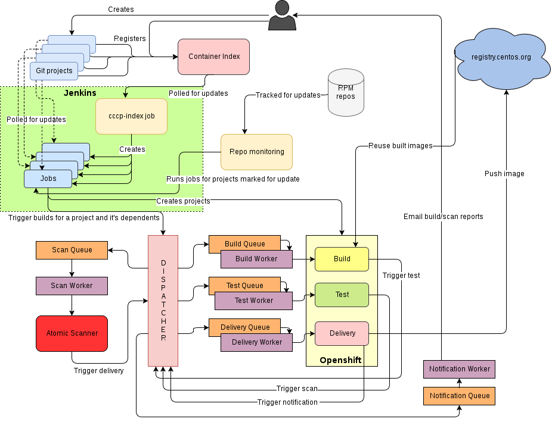

[![Build Status Widget]][Build Status]

----

CentOS Community Container Pipeline (CCCP) is an open-source platform to containerize applications based on CentOS.

**CCCP:** Builds the application (from a git repository) → Packages with the appropriate runtime → Tests and analyzes the image → Pushes image to a public registry

----

## Use Case

I have a certain stack I develop with (be it Django, Golang, NodeJS, Redis, RabbitMQ, etc.) using my favourite OS (CentOS) as a base platform. 

How do I package that application into a container that's updated automatically every time I push changes? What about security and updates, how do I automate that each time I push any changes?

That's where CCCP comes in. 

CCCP will:

  - Scan the image for updates, fixes, capabilities and push it to a public registry (by default, http://registry.centos.org)
  - Automatically rebuild when a change is detected within the repository. Such as an RPM package or base image (`FROM` in Dockerfile) update
  - Notifications / alerts regarding scan results (by e-mail)

## How do I host my application?

Similar to projects such as [Homebrew](https://github.com/Homebrew/homebrew-core) it's as easy as opening up a pull request.

A developer wishing to host their container image will open up a pull request to the [CentOS Container Index](https://github.com/CentOS/container-index). 

Once the pull request is merged, CCCP:

  1. Links the Dockerfile
  2. Builds the image
  3. Scans / analyzes it
  4. Pushes to [registry.centos.org](https://registry.centos.org)
  5. Notifies the developer (email)

Once a project is in the [CentOS Container Index](https://github.com/CentOS/container-index), the CentOS Container Pipeline Service service automatically tracks the project's Git repo and branch and rebuilds it every time there is a future change.

## How everything works

1. **Project onboard / the main "index"**

First off, the pipeline points to an index. For the CentOS community and in our example, this refers to the: [CentOS Container Index](https://github.com/CentOS/container-index). 

2. **Jenkins and OpenShift tracking**

Jenkins is utilized in order to track each application's Git repository as well as branch for any changes. This triggers a new build on **OpenShift** when a change is pushed.

Changes to the application's repository, update to the base image or any RPMs that are part of the image will trigger a new build

3. **Building the image**

The container image is built within OpenShift and then pushed to an internal registry. This results in an image tagged `image:test`.

4. **Test the application**

Tests as well as any scripts may be specified within the `yaml` file. For example, the `JenkinsBuilder` image uses a test to "tag" the resulting image (https://github.com/CentOS/container-pipeline-service/blob/master/jenkinsbuilder/project-defaults.yml#L20).

5. **Scan and analyze the image**

Scanning and analysis is done by using [Atomic](https://github.com/projectatomic/atomic).

Multiple [Atomic Scanners](/atomic_scanners) are ran on the built image:

- [pipeline-scanner](atomic_scanners/pipeline-scanner): Scans for any outdated yum packages
- [container-capabilities-scanner](atomic_scanners/container-capabilities-scanner): Scans for any security vulnerabitlies in the `RUN` command
- [atomic_scanners](atomic_scanners/misc-package-updates): Scans for outdated npm, pip and gem packages

After scanning and analysis, the resulting image is tagged and pushed to the registry as `image:rc`

6. **Push to the public registry (https://registry.centos.org)**

Finally, the image is re-tagged to its final name based on the value within the `yaml` file and pushed to https://registry.centos.org 

7. **Notification**

An email is sent out the developer mentioning the status of the build and scan process as well as a link to read the detailed logs.

**Notes:**

All the communication between the stages mentioned above happens via [beanstalkd](http://kr.github.io/beanstalkd/) tubes.

## Architecture

Here's the graphical representation of what is going on underneath-the-hood:



## Want to deploy your own pipeline?

This will allow you to bring up a single or multi-node setup of the Container Pipeline Service.

We use Ansible Playbooks in order to provision the service. As long as your OS is accesible over SSH, you can set up the host(s):

```sh
$ git clone https://github.com/CentOS/container-pipeline-service/
$ cd container-pipeline-service/provisions

# Copy sample hosts file and edit as needed
$ cp hosts.sample hosts
```

You can either have this span multiple-hosts or you can have an all-in-one setup by using the same host value in the `hosts` file.

**An SSL certificate is required on the host running the registry:**

Replace `registry.domain.com` with your own.

```bash
$ export REGISTRY=registry.domain.com
$ cd /etc/pki/tls/
$ openssl genrsa -out private/$REGISTRY.key 2048
$ openssl req -x509 -days 366 -new -key private/$REGISTRY.key -out certs/$REGISTRY.pem
```

**Provision using Ansible:**

```sh
# Provision the hosts. This assumes that you have added the usernames,
# passwords or private keys used to access the hosts in the hosts file
$ ansible-playbook -i hosts main.yml
```

## Contribute to the CentOS Community Container Pipeline Service

We're always looking for ideas and improvements for the service! If you're interested in contributing to this repository, follow these simple steps:

- open an issue on GitHub describing the feature/bug
- fork the repository
- work on your branch for the fix of the issue
- raise a pull request

Before a PR is merged, it must:

- pass the CI done on [CentOS CI](https://ci.centos.org/)
- be code reviewed by the maintainers
- have maintainers' LGTM (Looks Good To Me)

## Community

__Chat (Mattermost):__ Our prefered method to reach the main developers is through Mattermost at [chat.openshift.io](https://chat.openshift.io/developers/channels/container-apps).

__IRC:__ If you prefer IRC, we can reached at **#centos-devel** on Freenode.

__Email:__ You could always e-mail us as well at centos-devel@centos.org 

[Build Status]: https://ci.centos.org/view/Container/job/centos-container-pipeline-service-ci-pr/
[Build Status Widget]: https://ci.centos.org/view/Container/job/centos-container-pipeline-service-ci-pr/badge/icon
