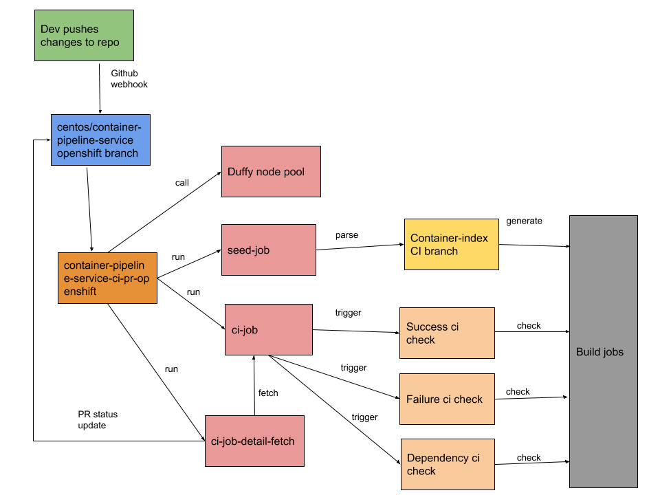

#### What is functional test:

Functional CI is about running functional tests in ci.centos.org for the whole build pipeline
to check its end to end functionality. This aims to check behavior for all the stages in the 
pipeline and matches with expected one. If there is any difference in expected and actual status
of the stages, CI fails else CI is marked as failure. In success and failure both the cases,
pipeline logs are printed to the jenkins console with status.

#### Purpose:

This is to test the end to end functionality of the service before deploying it to some infra. 
CI aims to make sure for an early feedback loop and runs on each push to the repository.

#### How it works:

[A job for Functional CI is setup in ci.centos.org](https://ci.centos.org/view/Container/job/centos-container-pipeline-service-ci-pr-openshift/)
for running the ci tests on pull requests raised against [openshift branch of container-pipeline-service](https://github.com/CentOS/container-pipeline-service/tree/openshift).
Once a PR is raised or updated gihub generates webhook which triggers a run of this job. 

This jobs starts with following steps

#### Get duffy nodes from [cico duffy pool](http://wiki.centos.org/QaWiki/CI/Duffy):

* Gets 4 duffy nodes from duffy node pool
  * One is used as ansible controller
  * One as NFS node for serving jenkins Persistent Volume and Container-registry
  * One as OpenShift master
  * One as OpenShift node
  
If the job is not able to get nodes from CICO duffy CI is marked as FAILURE.

#### Setting up nodes and deploying openshift cluster:

Once nodes are available, it sets up all the nodes according to their roles.
* `/etc/hosts entry` is added to all the nodes for resolving all the other nodes
* `ansible-controller` node's ssh pub key is added to root user of all the other nodes
* iptables allows *all the communicaitons among the nodes* and no node is exposed to outside
* `openshift-ansible` RPM is used for setting up the cluster using `hosts.ci` as inventory file

If openshift cluster and nodes are not setup to desired state, CI is  marked as FAILURE.

#### Deploying Jenkins and pipeline service:

* CI deploys the jenkins and pipeline service as normal deployment with following parameters
    * `CONTAINER_INDEX` points to https://github.com/centos/container-index.git
    * `CONTAINER_INDEX_BRANCH` points to `ci`

#### Running CI checks:

CI job runs in following sequence
* `seed-job` runs first. This parses the container-index and creates the pipeline jobs in OpenShift cluster
* `ci-job for success check` runs second. This triggers a build for the `bamachrn-python-release` build config.
Then matches all the stages with expected status.
  * Waits for a stage to *complete or fail* then checks the status and marks the pipeline as *pass or fail* based on that
  * If some stage is marked as failed (i.e. does not match with the expected status) whole CI is marked as **FAILURE**.
* `ci-job for failure check` runs third. This triggers a build for the `nshaikh-build-fail-test-latest` build config.
  * It expects the build to fail.
  * All the stages after build should not get triggered
  * single notification should get triggered.

After all three runs it checks if anything failed, if yes mark the CI as `FAILURE` else mark it as `SUCCESS`.

In the current scenario no test specific to the stages are added.

#### Releasing CICO duffy nodes:

Once the CI is complete (i.e. it is marked as SUCCESS or FAILURE) all the duffy-nodes are marked as done.
